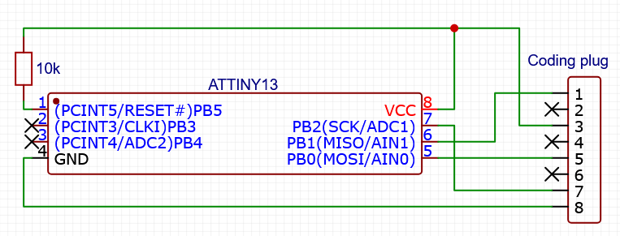

# HML087 emulator for ATtiny13
Firmware implementing HML087 chip emulation on ATtiny13 microcontroller.

## Supported configurations

| Number      | Configuration                              |
|-------------|--------------------------------------------|
| `1377368`   | E30 325e M20B27 5000RPM USA                |
| `1380873`   | E30 M3 S14 8000RPM Europe                  |
| `1385468`   | E30 325i M20B25 7000RPM USA                |
| `1394321`   | E30 318is M42B18 7000RPM USA               |

## Schematic

## Setup
- **Fuse configuration for ATtiny13:**
  - LOW fuse: `0x7A`
  - HIGH fuse: `0xFF`
    
## Acknowledgements
Special thanks to [faritka/hml087](https://github.com/faritka/hml087) for publishing the original ROM dumps
